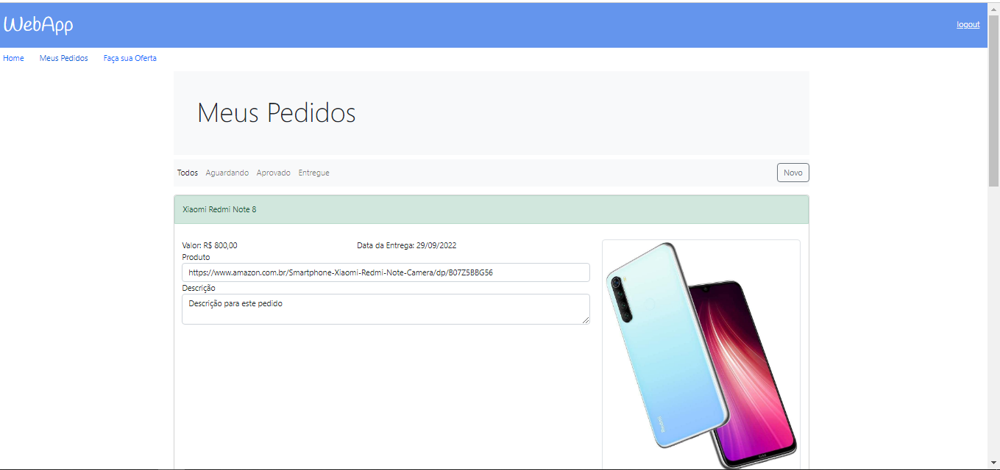

# WebApp-Compras-e-Vendas-Internacionais

<h2>Project Description<h2>

This is a Spring MVC project. It is a web application that aims to create a place 
where it's possible to buy objects through people who are going abroad.
For this purpose it was used the Spring MVC, Thymeleaf, Bootstrap, integration with Spring Data, API REST, AJAX, Vue.js e monitoramento com Interceptadores

 An image of the web page created is presented below

  

